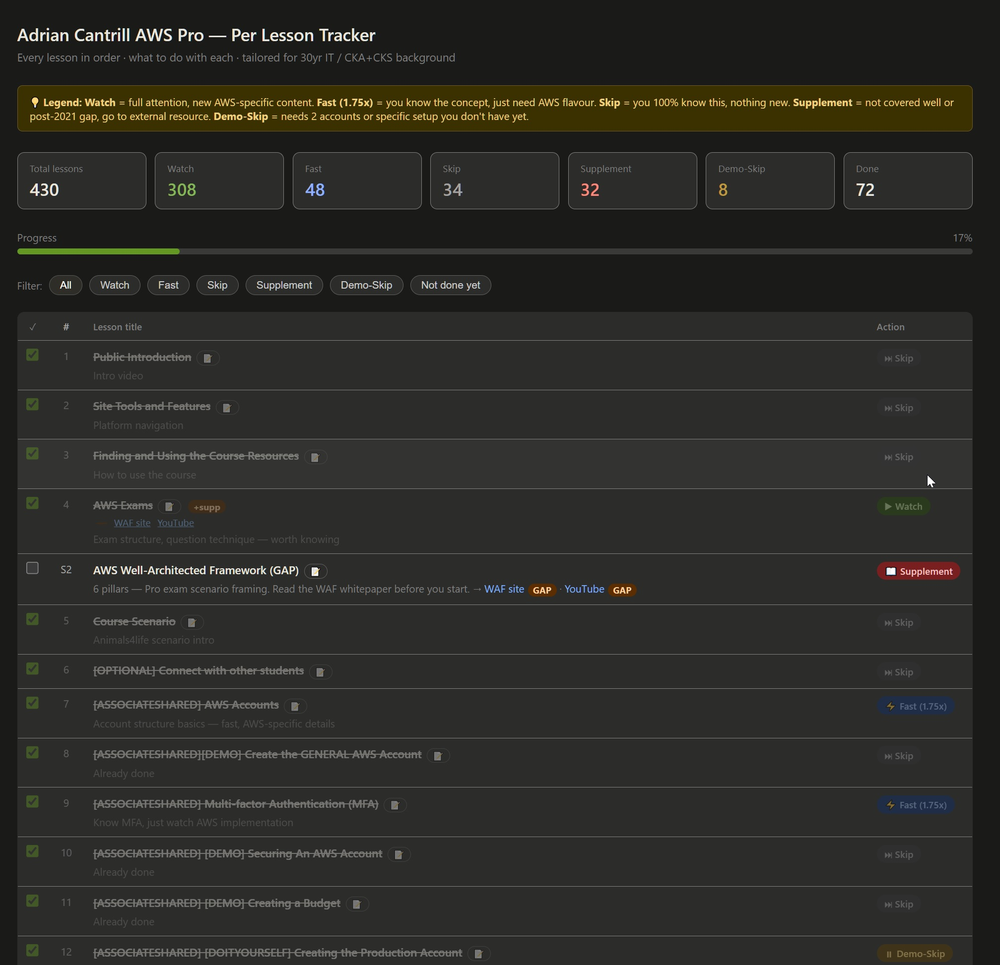

# Adrian Cantrill SAP-C02 Tracker

Per-lesson gap analysis tool for [Adrian Cantrill's AWS Solutions Architect Professional course](https://learn.cantrill.io/).

## What it does

- Every lesson (1–398) in order with a recommended action: **Watch**, **Fast (1.75x)**, **Skip**, or **Demo-Skip**
- **32 supplement entries** inserted inline at the right lesson — covering every post-2021 AWS gap (IAM Identity Center, MGN, Inspector v2, Aurora Serverless v2, Network Firewall, and more)
- Badge system: `OUTDATED` (Adrian's content superseded), `GAP` (not covered at all), `EXTRA` (bonus depth)
- `+supp` button on lessons with supplements — hover for tooltip, click to jump to the supplement row
- Per-lesson notes — click 📝 on hover, type, saves to localStorage. Gold highlight when a note exists, tooltip on hover
- Progress tracking with localStorage — survives page reload
- Filter by action type or "Not done yet"

## How to use

Download `adrian_per_lesson_tracker.html` and open it in any browser. No server needed, no install.

## Stack

Vanilla JS · localStorage · zero dependencies
